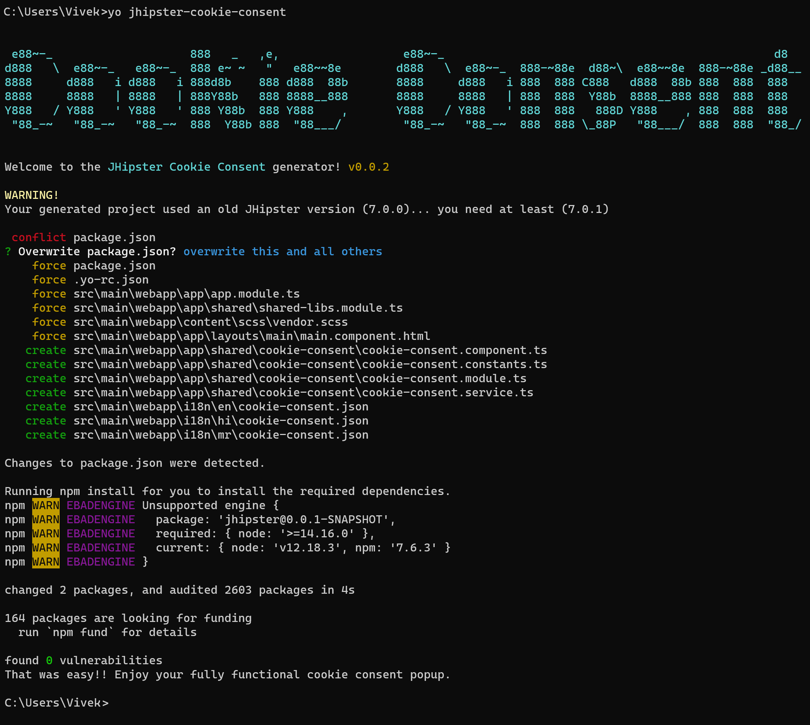

# Add a Cookie Consent popup to your JHipster app !!!
[![NPM version][npm-image]][npm-url] 
[![Dependency Status][daviddm-image]][daviddm-url] 
[![Build Status][travis-image]][travis-url] 
[![Generator Build Status][github-actions-image]][github-actions-url]
[![Coverage Status][coveralls-image]][coveralls-url]

[![Donate][donate-image]][donate-url]


# Introduction

This generator adds a fully functional [cookie consent popup](docs/features/COOKIE_CONSENT_COMPONENT.md) to your [JHipster](http://jhipster.github.io/) application.


# Installing JHipster
To install JHipster globally:

#### with NPM

To install this module globally:
```bash
npm install -g generator-jhipster
```


#### with Yarn

To install this module globally:
```bash
yarn global add generator-jhipster
```

[More information on official site](https://jhipster.github.io/installation.html)


# Installing the generator-jhipster-cookie-consent module

#### with NPM

To install this module globally:
```bash
npm install -g generator-jhipster-cookie-consent
```


#### with Yarn

To install this module globally:
```bash
yarn global add generator-jhipster-cookie-consent
```


# Usage

To generate a specific component(s) on an application generated by [JHipster](http://jhipster.github.io/):

```bash
cd my-jhipster-project
npx yo@4.0.0-beta.0 jhipster-cookie-consent
```

### ⚠ **Note**: 
`yo@3.x` won't work as `jhipster-cookie-consent` requires `yeoman-environment` at least **
3.0.0**, and `yo@3.x` currently works with **2.10.3**

# Updating this module

#### with NPM

```bash
npm update -g generator-jhipster-cookie-consent
```

#### with Yarn

```bash
yarn global upgrade generator-jhipster-cookie-consent
```


# License

Apache-2.0 © [Vivek More]


-----

#💚 this module? [![Donate][donate-image]][donate-url]

[donate-image]: https://img.shields.io/badge/buy%20me%20a%20coffee-brightgreen?style=for-the-badge&logo=paypal
[donate-url]: https://www.paypal.me/vivekdmore

[npm-image]: https://img.shields.io/npm/v/generator-jhipster-cookie-consent.svg
[npm-url]: https://npmjs.org/package/generator-jhipster-cookie-consent
[travis-image]: https://img.shields.io/travis/vivekmore/generator-jhipster-cookie-consent?label=travis-ci&logo=travis
[travis-url]: https://travis-ci.org/vivekmore/generator-jhipster-cookie-consent
[daviddm-image]: https://david-dm.org/vivekmore/generator-jhipster-cookie-consent.svg?theme=shields.io
[daviddm-url]: https://david-dm.org/vivekmore/generator-jhipster-cookie-consent
[coveralls-image]: https://coveralls.io/repos/github/vivekmore/generator-jhipster-cookie-consent/badge.svg
[coveralls-url]: https://coveralls.io/github/vivekmore/generator-jhipster-cookie-consent
[github-actions-image]: https://img.shields.io/github/workflow/status/vivekmore/generator-jhipster-cookie-consent/Build?label=github-ci&logo=github
[github-actions-url]: https://github.com/vivekmore/generator-jhipster-cookie-consent/actions
[donate-image]: https://img.shields.io/badge/buy%20me%20a%20coffee-brightgreen?style=for-the-badge&logo=paypal
[donate-url]: https://www.paypal.me/vivekdmore
