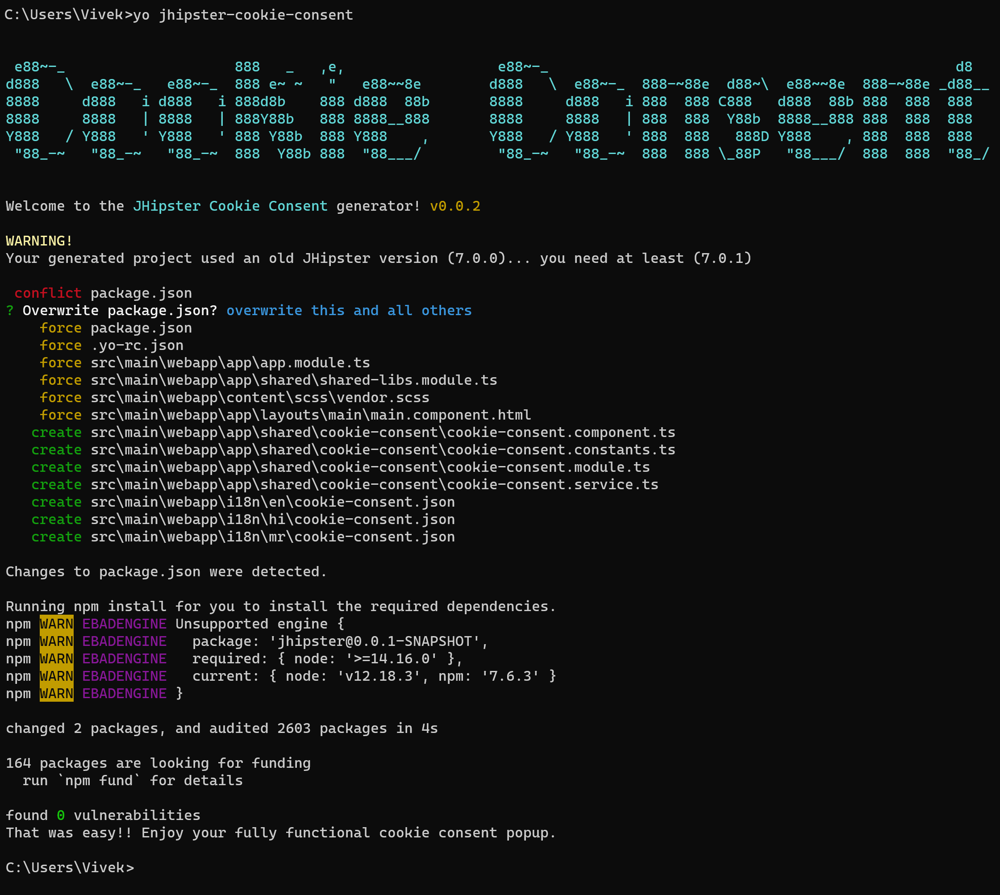

# A Cookie Consent Popup

This template creates a cookie consent popup using `ngx-cookieconsent` module
The following (client-side) artifacts are modified:

##### 1. Angular application:
 
- *️⃣ `package.json`
- *️⃣ `package-lock.json`
- *️⃣ `src/main/webapp/app/app.module.ts`
- *️⃣ `src/main/webapp/app/layouts/main/main.component.html`
- 🆕 `src/main/webapp/app/shared/cookie-consent/cookie-consent.component.ts`
- 🆕 `src/main/webapp/app/shared/cookie-consent/cookie-consent.constants.ts`
- 🆕 `src/main/webapp/app/shared/cookie-consent/cookie-consent.module.ts`
- 🆕 `src/main/webapp/app/shared/cookie-consent/cookie-consent.service.ts`
- *️⃣ `src/main/webapp/app/shared/shared-libs.module.ts`
- *️⃣ `src/main/webapp/content/scss/vendor.scss`
- 🆕 `src/main/webapp/i18n/<lang>/cookie-consent.json`

##### 2. React:

- *️⃣ `package.json`
- *️⃣ `package-lock.json`
- *️⃣ `src/main/webapp/app/app.tsx`
- 🆕 `src/main/webapp/app/shared/cookie-consent/cookie-consent.tsx`
- 🆕 `src/main/webapp/i18n/<lang>/cookie-consent.json`

##### 3. Vue:
 * Not supported currently

🆕 added files
*️⃣ modified files

-----

#💚 this module? [![Donate][donate-image]][donate-url]

[donate-image]: https://img.shields.io/badge/buy%20me%20a%20coffee-brightgreen?style=for-the-badge&logo=paypal
[donate-url]: https://www.paypal.me/vivekdmore
